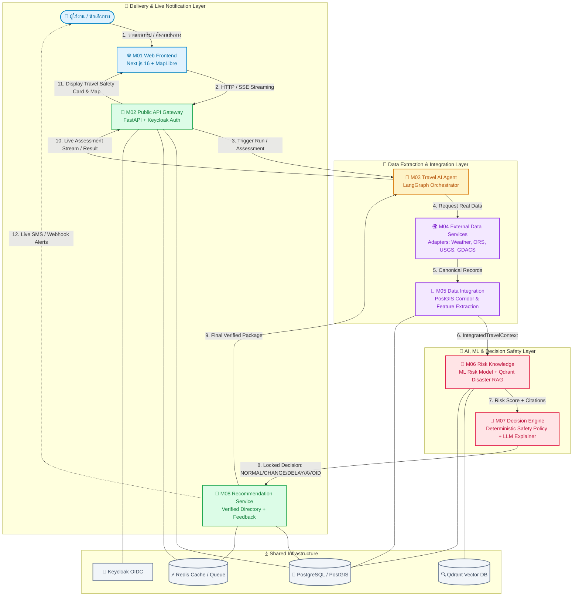

# 🌟 SafetyTravel Assistant (travel-safety-ai) 🛡️✈️
> **"ทริปนี้ไปได้ไหม ปลอดภัยแค่ไหน ถ้าไม่ปลอดภัยควรทำยังไง"** 💖
> เว็บแอปพลิเคชันอัจฉริยะประเมินความปลอดภัยการเดินทางแบบ Real-time ด้วย AI, ข้อมูลภัยพิบัติจริง และระบบความปลอดภัยขั้นสูง

---

## 👥 รายชื่อสมาชิกและทีมผู้รับผิดชอบแต่ละโมดูล (Team Members & Modules)

โปรเจกต์นี้แบ่งการทำงานออกเป็น **8 โมดูลหลัก (8 Workstreams)** โดยสมาชิกแต่ละคนรับผิดชอบพัฒนา ตรวจสอบ และเปิด Pull Request ในส่วนงานของตนเองอย่างเป็นระบบ:

| โมดูล | ผู้รับผิดชอบ | รหัสนักศึกษา | GitHub Profile | ขอบเขตหน้าที่และความรับผิดชอบหลัก (Core Responsibilities) |
| :--- | :--- | :--- | :--- | :--- |
| **M01** | **เตชิษฏ์ จาดยางโทน** | `116730462040-0` | [@TJANDFRIEND](https://github.com/TJANDFRIEND) | 🌐 **Web Frontend Application (`apps/web/`)** • พัฒนาหน้าเว็บด้วย Next.js 16, React 19, Tailwind CSS และ MapLibre GL • หน้า UI ครบ 6 ส่วน: Trip Planner, Route Comparison, Safety Map, Assistant, Emergency, Live Risk Dashboard • เชื่อมต่อ Public API จริง แสดงผลแผนที่ เส้นทาง ความสดของข้อมูล และสถานะความเสี่ยง |
| **M02** | **กฤษณพงศ์ พรภู่** | `116730462018-6` | [@9kritsanapong9](https://github.com/9kritsanapong9) | 🔐 **API Backend & Security Gateway (`services/api/`, `packages/contracts/`)** • ดูแล Public Gateway (FastAPI) และ Contract มาตรฐานกลางของระบบ • ระบบพิสูจน์ตัวตน Keycloak OIDC/JWT, Consent Management (PDPA/GDPR) • Trip CRUD, Assessment Run Orchestration, SSE Live Streaming, Rate Limiting และ Load Resilience |
| **M03** | **วิทยา จำรูญนุรักษ์** | `116610462040-4` | [@Wittaya211204](https://github.com/Wittaya211204) | 🤖 **Travel AI Agent Orchestration (`services/agent/`)** • พัฒนา AI Workflow Engine ด้วย LangGraph แบบ Finite State Machine (FSM) • วางแผนการทำงาน (Execution Plan) สั่งการ Tools ไปยังโมดูล 04–08 ตามลำดับ • จัดการ Timeout, Error Degradation, State Checkpointing และส่งต่อ Evidence ครบถ้วน |
| **M04** | **ประภากรณ์ ภิธรรมมา** | `116730462033-5` | [@BBosX](https://github.com/BBosX) / [@prapakorn](https://github.com/prapakorn) | 🌍 **External Data Services (`services/external-data/`)** • พัฒนา Adapter ดึงข้อมูลสดจากแหล่งข้อมูลจริง (Zero Mock Policy) • Open-Meteo (สภาพอากาศ/Geocoding), OpenRouteService (เส้นทาง/POIs), USGS (แผ่นดินไหว), GDACS/NASA EONET (ภัยพิบัติโลก), GTFS (ขนส่งสาธารณะ) • แปลงข้อมูลเป็น Canonical Contract พร้อมบันทึก Data Provenance & Freshness |
| **M05** | **สิรวิชญ์ ศิริสลุง** | `116730462023-6` | [@Peemaxnaja](https://github.com/Peemaxnaja) | 🧩 **Data Integration & Spatial Corridor (`services/data-integration/`)** • รวมและประมวลผลข้อมูลเชิงพื้นที่ด้วย PostGIS Spatial Buffer & Route Corridors • ทำ Data Normalization, Deduplication, Conflict Resolution ระหว่างหลาย Provider • สกัด Feature Vector และ Data-Quality Flags ส่งมอบเป็น `IntegratedTravelContext` ให้โมดูล 06 |
| **M06** | **รัชชานนท์ ศรีไชย** | `116730462005-3` | [@Racharnon-Srichai](https://github.com/Racharnon-Srichai) | 🧠 **Risk Knowledge & Disaster RAG (`services/risk-knowledge/`)** • พัฒนาโมเดล Machine Learning ประเมินระดับความเสี่ยงเส้นทาง (ML Risk Scoring Model) • สร้าง Disaster RAG บน Qdrant Vector Database ดึงข้อมูลคู่มือรับมือภัยพิบัติพร้อม Citation อ้างอิง • ประเมิน Exposure ตลอดแนวเส้นทาง พร้อมบังคับ Hard Constraints (พื้นที่ปิด/อพยพ) |
| **M07** | **ปกครอง ทับโทน** | `116730462041-8` | [@24madcap](https://github.com/24madcap) | 🚦 **Decision Engine & Policy Guardrails (`services/decision-engine/`)** • กำหนดและประมวลผล Safety Policy แบบ Deterministic Rules ไม่ปล่อยให้ LLM คิดคำตอบเอง • ตัดสินผลชี้ขาด 4 ระดับ: `NORMAL`, `CHANGE_ROUTE`, `DELAY`, `AVOID` • ควบคุม LLM Explainer ให้สรุปเหตุผลและคำแนะนำตาม Fact & Policy พร้อม Fallback เมื่อฉุกเฉิน |
| **M08** | **นิธิศ มะโนรา** *(Lead)* | `116730462042-6` | [@PROxTAE](https://github.com/PROxTAE) | 🧭 **Recommendation Delivery & Feedback (`services/recommendation/`)** • ประกอบ Recommendation Response ฉบับสมบูรณ์ พร้อม Emergency Contacts ที่ตรวจสอบแล้ว • ระบบติดตามสถานะสดและส่ง Live Alert (SMS / Webhook) ตามความยินยอมของผู้ใช้ • ระบบ Feedback Governance Loop และดูแลโครงสร้างภาพรวมของระบบ (Project Lead) |

---

## 🏗️ สถาปัตยกรรมและการทำงานร่วมกันของระบบ (System Architecture & Data Flow)

การทำงานของระบบเป็นแบบ **Microservices Architecture** ที่สื่อสารกันผ่าน REST API, SSE และ Event Stream โดยมี Data Contracts กำกับอย่างเข้มงวด:

---

## 🔄 ลำดับขั้นตอนการทำงานแบบ Step-by-Step (How It Works)

1. **ผู้ใช้เริ่มต้นวางแผนการเดินทาง (Trip Request)**:
   - ผู้ใช้ป้อนจุดเริ่มต้น ปลายทาง วันที่เดินทาง และโหมดการเดินทาง (รถยนต์, รถบัส, รถไฟ, เดิน ฯลฯ) ผ่านหน้าเว็บ **M01 Web**
2. **การตรวจสอบสิทธิ์และรับคำขอ (API Gateway & Security)**:
   - **M02 API** ตรวจสอบ JWT Token จาก Keycloak, บันทึกทริป, ตรวจ Consent การใช้งานพิกัด และส่ง Job ไปยัง **M03 Agent**
3. **การวางแผนและดึงข้อมูลภายนอก (Orchestration & Data Gathering)**:
   - **M03 Agent** วิเคราะห์ Intent และสั่งให้ **M04 External Data** ยิงเรียก API จริง (Open-Meteo, OpenRouteService, USGS, GDACS, EONET) พร้อมตรวจสอบสถานะความสด (Freshness)
4. **การรวมข้อมูลเชิงพื้นที่ตามแนวเส้นทาง (Spatial Alignment)**:
   - **M05 Data Integration** นำเส้นทางมาสร้างแนวกันชน (Route Corridor) ด้วย PostGIS, กรองเฉพาะภัยพิบัติและสภาพอากาศที่กระทบเส้นทางจริง, จัดการข้อมูลซ้ำซ้อน และสกัด Feature Vector
5. **การวิเคราะห์ความเสี่ยงและค้นหาคู่มือรับมือ (ML Scoring & RAG)**:
   - **M06 Risk Knowledge** นำ Feature Vector เข้าโมเดล Machine Learning เพื่อคำนวณคะแนนความเสี่ยง พร้อมค้นหาคู่มือรับมือภัยพิบัติที่ตรงจุดจาก **Qdrant Vector DB**
6. **การตัดสินใจอย่างปลอดภัยขั้นเด็ดขาด (Safety Policy Enforcement)**:
   - **M07 Decision Engine** ใช้ Policy แบบ Deterministic ตรวจสอบ Hard Constraints (เช่น น้ำท่วมตัดทาง, ดินถล่ม, ถนนปิด) แล้วเคาะผลลัพธ์เป็น 1 ใน 4 ระดับ:
     - 🟢 `NORMAL` (เดินทางได้ตามปกติ)
     - 🟡 `CHANGE_ROUTE` (แนะนำเปลี่ยนเส้นทางเลี่ยงจุดเสี่ยง)
     - 🟠 `DELAY` (แนะนำเลื่อนเวลาเดินทางออกไปก่อน)
     - 🔴 `AVOID` (อันตรายสูง แนะนำงดหรือยกเลิกการเดินทาง)
   - จากนั้นล็อกผลการตัดสินใจ แล้วให้ LLM ช่วยเขียนคำอธิบายโดยอ้างอิงเฉพาะข้อเท็จจริงที่มีการยืนยันแล้วเท่านั้น (ห้าม LLM ตัดสินใจเอง)
7. **การส่งมอบคำแนะนำและการแจ้งเตือน (Delivery & Alert)**:
   - **M08 Recommendation** แนบรายชื่อหน่วยงานและเบอร์โทรฉุกเฉินที่ตรวจสอบแล้วในพื้นที่ ส่งผลลัพธ์กลับสู่ **M01 Web** ผ่าน SSE และตั้งระบบติดตามเพื่อส่ง SMS/Webhook เตือนทันทีหากความเสี่ยงเปลี่ยนไประหว่างเดินทาง

---

## 🌟 จุดเด่นและนวัตกรรมของโปรเจกต์ (Key Highlights & Innovation)

* 🛡️ **Zero Mock Policy (ข้อมูลจริง 100%)**:
  ไม่มีการจำลองข้อมูลสภาพอากาศหรือภัยพิบัติขึ้นมาเอง ระบบดึงจากผู้ให้บริการระดับโลกแบบ Real-time พร้อมแสดงแหล่งที่มา (Provenance) และเวลาอัปเดตอย่างโปร่งใส
* 🚦 **Deterministic Safety Boundary (ความปลอดภัยสูงสุด)**:
  ป้องกันปัญหา AI ภาพหลอน (Hallucination) โดยแยกส่วนการตัดสินใจความปลอดภัยออกจาก LLM ด้วย Deterministic Policy Rules ที่ผ่านการทดสอบอย่างเข้มงวด
* 🧠 **Hybrid Multi-Stage AI**:
  ผสมผสานทั้ง **Machine Learning (Tabular Risk Scoring)**, **Vector RAG (Disaster Knowledge Retrieval)** และ **Constrained LLM (Explainable Insights)**
* 📍 **Route Corridor Spatial Intelligence**:
  วิเคราะห์ความเสี่ยงตลอดทั้งแนวเส้นทางการเดินทางด้วย PostGIS Spatial Geometry ไม่ใช่ดูแค่สภาพอากาศที่จุดเริ่มต้นหรือปลายทางเท่านั้น
* 🚨 **Verified Emergency Support & Active Subscriptions**:
  มีสมุดโทรศัพท์ฉุกเฉินระดับท้องถิ่นที่ตรวจสอบแล้วตามพิกัดจริง พร้อมระบบเฝ้าระวังความเสี่ยงระหว่างทริปและแจ้งเตือนทันที

---

## 📱 ฟีเจอร์หลักในระบบ (Core Features)

1. 🗺️ **Smart Trip Planner & Alternative Routes**: วางแผนการเดินทาง คำนวณเส้นทางหลักและเส้นทางสำรอง พร้อมเปรียบเทียบระดับความเสี่ยงของแต่ละเส้นทาง
2. 🚨 **Live Risk & Hazard Map**: แผนที่ Interactive แสดงสภาพอากาศ ปริมาณฝน จุดเตือนภัย แผ่นดินไหว และเหตุการณ์ฉุกเฉินแบบ Real-time
3. 💬 **AI Travel Safety Assistant**: ผู้ช่วย AI สนทนาสอบถามความปลอดภัย ตอบคำถามเกี่ยวกับการเตรียมตัวและสภาพเส้นทาง
4. 🚑 **Local Emergency Directory**: รวบรวมเบอร์โทรสายด่วน โรงพยาบาล สถานีตำรวจ และหน่วยกู้ภัยในพื้นที่ใกล้เคียงเส้นทาง
5. 🔔 **Trip Safety Monitoring & Alerts**: ระบบเฝ้าระวังทริปเดินทาง ส่งแจ้งเตือนเมื่อตรวจพบภัยพิบัติหรือสภาพอากาศเลวร้ายที่เกิดขึ้นใหม่
6. 📊 **Travel Safety Dashboard**: ศูนย์รวมข้อมูลสรุปภาพรวมความปลอดภัย ประวัติการเดินทาง และการจัดการความยินยอมด้านข้อมูลส่วนบุคคล (Privacy & Consent)

---

## 🛠️ Tech Stack ภาพรวมของโปรเจกต์

* **Frontend**: Next.js 16 (App Router), React 19, TypeScript, Tailwind CSS, MapLibre GL
* **Backend API & Microservices**: FastAPI (Python 3.12+), Uvicorn, Pydantic v2, SQLAlchemy, Alembic
* **AI / Orchestration**: LangGraph, Gemini 3.6 Flash / LLM Engine, Qdrant Vector DB, Sentence-Transformers
* **Databases & Cache**: PostgreSQL 16 with PostGIS 3.4 Extension, Redis 7 (Alpine)
* **Authentication & Security**: Keycloak 26 (OIDC/OAuth2), OpenID Connect JWT, Cryptography (AES-GCM)
* **DevOps & Containerization**: Docker Compose, Multi-stage Dockerfiles, GitHub Actions CI/CD
