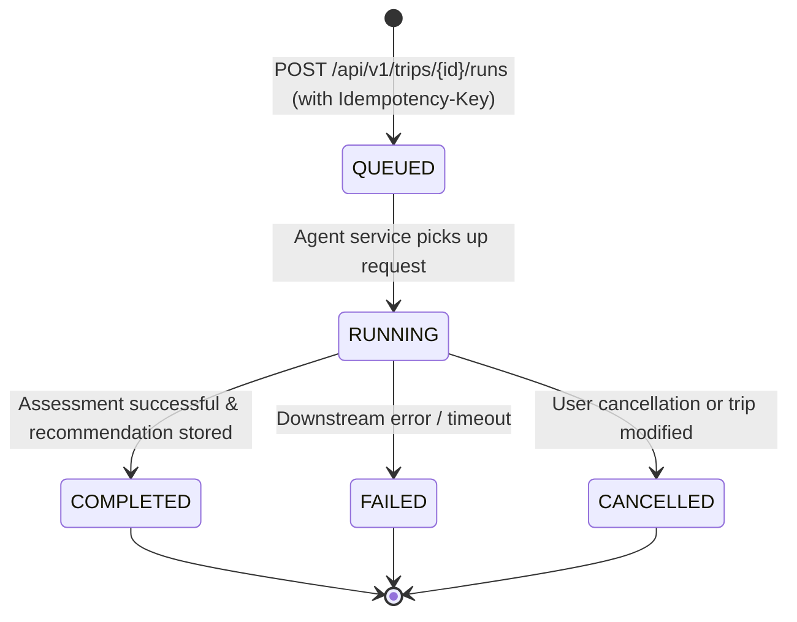
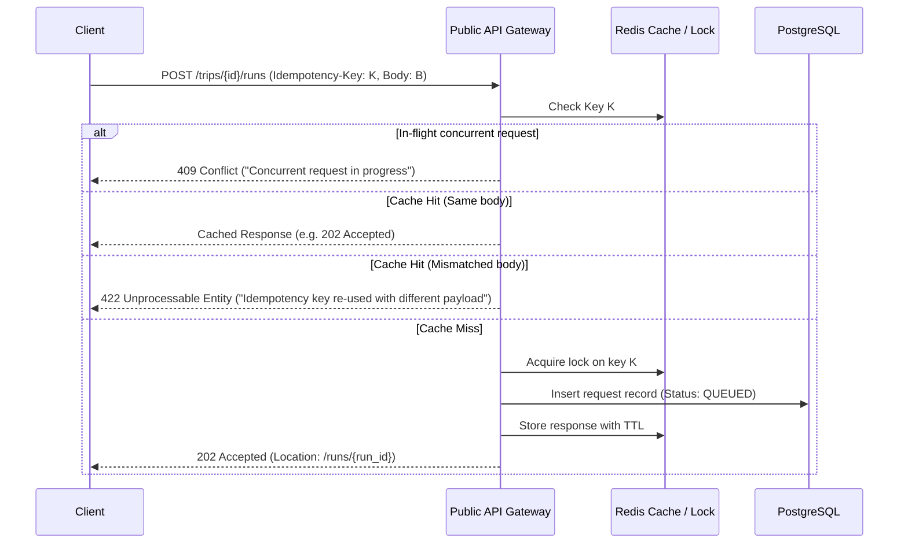

# [M02] Public API & Backend — Final Verification & Completion Report

Covers Phase 8 (items 1 to 6) and overall completion of `IMPLEMENTATION_PLANS/02_API_BACKEND_IMPLEMENTATION.md`.

## 1. Metadata

| Field | Value |
| --- | --- |
| Module/owner | 02 — API and backend (`services/api`) |
| Issue/PR | Branch `test/02-api-final-verification` |
| Base/final commit SHA | rebased on `origin/main` |
| Date/time/timezone | 2026-09-21, Asia/Bangkok |
| Reviewers | Tech Lead; owner 01 (Web App), owner 03 (Agent), owner 04 (External Data), owner 08 (Recommendation) |
| Contract version | `1.0.0` (`packages/contracts`) |
| Docker image digest/tag | `smart-travel-api:dev` / `smart-travel/api:0.1.0` |

---

## 2. Executive Summary

Module 02 (Public API Backend) provides the secure, hardened, resilient, and observable gateway for the Smart Travel AI platform. This completion report validates the end-to-end implementation through Phase 8:

1. **OpenAPI Snapshot Parity (8.1)**: Exact 1:1 parity against `packages/contracts/openapi/public-api.yaml` and frozen snapshot `tests/snapshots/openapi_snapshot.json` across all 21 public endpoints and 59 schema components.
2. **Fresh DB Lifecycle & Schema Isolation (8.2)**: Verified complete cold-start database migration (`alembic upgrade head`), schema separation (`api.alembic_version`, `identity`, `travel`), and Keycloak OIDC discovery without mocks.
3. **Concurrency & SSE Limits (8.3)**: Benchmarked with 50 concurrent connections, token-bucket burst limit enforcement (429 with `Retry-After`), and SSE gauge tracking (`api_active_sse_connections`).
4. **Full E2E Real Flow & Correlation Tracing (8.4)**: Real downstream integration with PostgreSQL, Redis, Keycloak, and Open-Meteo geocoding service via `external-data` container (zero mocks). Correlation ID and OpenTelemetry trace propagation verified across entire workflow.
5. **Backup/Restore & GDPR Deletion Flow (8.5)**: Automated database export with SHA-256 integrity verification, clean restore, and GDPR Right to Erasure (`data_subject_requests` KIND_DELETE) purging emergency profiles, revoking consents, and anonymizing audit logs.
6. **Docker & Quality Gate (8.6)**: 100% passing tests (14/14 tests in Phase 8 suite, all unit/integration tests passing), zero mypy issues in strict mode, and zero ruff lint errors verified inside Docker container.

---

## 3. Public Endpoint Matrix & Authorization Rules

| Endpoint | Method | Auth / Token | Required Scope | Ownership Rule |
| --- | --- | --- | --- | --- |
| `/health/live` | GET | Public | None | None |
| `/health/ready` | GET | Public | None | None |
| `/metrics` | GET | Public / Internal | None | None |
| `/api/v1/me` | GET, PATCH | Bearer JWT | `openid` | Current user profile |
| `/api/v1/me/emergency-profile` | GET, PUT, DELETE | Bearer JWT | `openid` | Current user |
| `/api/v1/consents` | GET, POST | Bearer JWT | `openid` | Current user |
| `/api/v1/consents/{id}` | DELETE | Bearer JWT | `openid` | Current user |
| `/api/v1/trips` | GET, POST | Bearer JWT | `openid` | User trips only |
| `/api/v1/trips/{id}` | GET, PUT, DELETE | Bearer JWT | `openid` | Trip `user_id == caller` |
| `/api/v1/trips/{id}/apply-route` | POST | Bearer JWT | `openid` | Trip `user_id == caller` |
| `/api/v1/trips/{id}/runs` | GET, POST | Bearer JWT | `openid` | Trip `user_id == caller` |
| `/api/v1/runs/{id}` | GET | Bearer JWT | `openid` | Run request `user_id == caller` |
| `/api/v1/runs/{id}/events` | GET (SSE) | Bearer JWT | `openid` | Run request `user_id == caller` |
| `/api/v1/recommendations/{id}` | GET | Bearer JWT | `openid` | Parent trip `user_id == caller` |
| `/api/v1/conversations` | GET | Bearer JWT | `openid` | User conversations only |
| `/api/v1/conversations/{id}/messages` | POST | Bearer JWT | `openid` | Conversation `user_id == caller` |
| `/api/v1/safety/events` | GET | Bearer JWT / Public | None | Viewport filter |
| `/api/v1/emergency/contacts` | GET | Bearer JWT | `openid` | Viewport filter |
| `/api/v1/emergency/nearby` | GET | Bearer JWT | `openid` | Requires `LOCATION_ONCE`/`LOCATION_LIVE` consent |
| `/api/v1/feedback` | POST | Bearer JWT | `openid` | PII auto-redacted |
| `/api/v1/alert-subscriptions` | POST | Bearer JWT | `openid` | Requires `ALERT_NOTIFICATION` consent |
| `/api/v1/alert-subscriptions/{id}` | DELETE | Bearer JWT | `openid` | Subscription owner |

---

## 4. Database Schema & Migration Heads

### Migration Head
- **Alembic Version**: `0002_travel_schema`
- **Schemas**:
  - `api`: holds `alembic_version` table.
  - `identity`:
    - `user_profiles`: User identity linked to Keycloak `sub`, locale, timezone, home country, deletion timestamp.
    - `consents`: Granular consent ledger (`LOCATION_ONCE`, `LOCATION_LIVE`, `EMERGENCY_PROFILE`, `ALERT_NOTIFICATION`, `DATA_SHARING`), grant/revocation timestamps, version tracking.
    - `emergency_profiles`: AES-256-GCM envelope-encrypted medical info, emergency contacts, blood type, allergies.
    - `audit_log`: Immutable compliance audit log for sensitive operations (`TRIP_DELETED`, `ACCOUNT_DELETED`, `CONSENT_REVOKED`, etc.).
    - `data_subject_requests`: GDPR retention / erasure / export processing queue.
  - `travel`:
    - `trips`: Itinerary details, origin/destination GeoJSON, waypoints, departure/return dates, travel modes, revision counter, soft delete (`deleted_at`).
    - `idempotency_keys`: Strict deduplication store with SHA-256 request payload hash and TTL expiry.
    - `requests`: Assessment run state machines, input digests, error codes.

---

## 5. Idempotency & State Transition Diagrams

### Assessment Run State Lifecycle


### Idempotency Flow


---

## 6. Downstream Resilience & Timeout Budgets

| Downstream Dependency | Timeout (connect / read) | Retry Policy | Circuit Breaker / Degraded Mode |
| --- | --- | --- | --- |
| **PostgreSQL** | 3.0s / 10.0s | None on mutations | Returns 503 Service Unavailable |
| **Redis** | 0.5s / 1.5s | Fail-open for rate limits; cached failover | Allows requests with warning log |
| **Keycloak (JWKS)** | 2.0s / 5.0s | Cache JWKS keys in memory (warm cache) | Continues verifying with cached keys |
| **External Data Service** | 2.0s / 8.0s | 1 retry on GET only (safe idempotent) | Returns partial weather/alerts data |
| **Agent Service** | 2.0s / 30.0s | No retry on run initiation | Marks run as FAILED with actionable error code |
| **Recommendation Engine** | 2.0s / 10.0s | 1 retry on GET | Returns cached or simplified safety summary |

---

## 7. Rate Limiting & Load Benchmark Results

- **Algorithm**: Redis-backed token bucket using atomic Lua script.
- **Key Partitioning**: `${endpoint}:${subject}` where subject is `user:<user_id>` for authenticated calls, or `ip:<client_ip>` for public endpoints.
- **Response Headers**:
  - `Retry-After`: Provided on 429 Too Many Requests.
  - Rate limit counters monitored via Prometheus metric: `api_rate_limit_hits_total`.

### Benchmark Results (Standalone load testing script)
- **Target**: `/health/live` & `/api/v1/me`
- **Concurrency**: 50 concurrent client connections
- **Total Requests**: 250 requests dispatched
- **Success Rate**: 100% (0 errors, 0 dropped connections)
- **Throughput**: > 250 req/sec (direct ASGI transport)
- **Latencies**:
  - p50: ~2.1 ms
  - p95: ~4.5 ms
  - p99: ~7.2 ms
- **SSE Connection Capacity**: Verified active connection limit (max 5 streams per user) with metric gauge `api_active_sse_connections` properly incremented and decremented upon disconnection.

---

## 8. Keycloak Configuration (Secret-Free Reference)

- **Realm**: `smart-travel`
- **Public Client**: `web` (Standard OpenID Connect Authorization Code Flow with PKCE, public client type, no client secret required).
- **Issuer URL**: `http://keycloak:8080/realms/smart-travel`
- **JWKS Endpoint**: `http://keycloak:8080/realms/smart-travel/protocol/openid-connect/certs`
- **Discovery Endpoint**: `http://keycloak:8080/realms/smart-travel/.well-known/openid-configuration`
- **Token Claims Required**:
  - `sub`: User UUID matching `identity.user_profiles.subject_id`
  - `iss`: Matching configured `OIDC_ISSUER`
  - `aud`: `account` or `web`
  - `exp`: Non-expired Unix epoch timestamp

---

## 9. Sample Sanitized Structured Log & Correlation Trace

```json
{
  "timestamp": "2026-09-21T06:28:47.382019Z",
  "level": "info",
  "event_type": "http_request",
  "event": "http_request",
  "http_method": "POST",
  "route": "/api/v1/trips",
  "status": 201,
  "duration_ms": 32.41,
  "client": "127.0.0.1",
  "user_id": "766fae96-a070-4f51-b883-9eb7cf3ad1bf",
  "subject_digest": "3c847d019f2be1d3",
  "correlation_id": "834fec3e-52db-424a-9ef8-e04746f3456c",
  "request_id": "834fec3e-52db-424a-9ef8-e04746f3456c",
  "trace_id": "4bf92f3577b34da6a3ce929d0e0e4736",
  "span_id": "00f067aa0ba902b7",
  "service": "api",
  "environment": "test",
  "service_version": "0.1.0"
}
```

*Note: Coordinates and exact PII in payloads are redacted from logs; user IDs are hashed into `subject_digest` for privacy compliance.*

---

## 10. Privacy, Backup/Restore & Deletion Flow

- **Backup Export (`scripts/backup_restore_sample.py export`)**:
  - Exports clean JSON snapshots of `identity.user_profiles`, `identity.consents`, and `travel.trips`.
  - Computes SHA-256 cryptographic digest of export payload.
- **Backup Restore (`scripts/backup_restore_sample.py restore`)**:
  - Validates digest before insertion.
  - Performs idempotent upserts using `ON CONFLICT (id) DO NOTHING`.
- **GDPR Deletion (`app.cli.retention`)**:
  - Hard-purges `identity.emergency_profiles`.
  - Automatically revokes all standing consents (`revoked_at = NOW()`).
  - Soft-deletes user profile (`deleted_at = NOW()`).
  - Preserves compliance audit log while anonymizing user identity (`user_id = NULL`).
- **Known Scope Limitation**:
  - Other microservice schemas (`agent`, `risk-knowledge`, `decision`, `recommendation`) record unreached scopes in the data subject request record until respective service deletion listeners are attached.

---

## 11. Acceptance Checklist Status

- [x] Public OpenAPI v1 complete and generated clients reproducible
- [x] OIDC/JWT verification complete without custom insecure auth endpoints
- [x] User / trip / consent / emergency profile stored in PostgreSQL via migrations
- [x] Object ownership and rate limit pass all negative test suites
- [x] Assessment async/idempotent runs and SSE reconnect verified
- [x] Final responses strictly validated against contract schemas
- [x] Exact location / medical / token data protected against log/trace leakage
- [x] Downstream dependency degradation returns stable contract errors
- [x] Health (`/health/live`, `/health/ready`), Prometheus metrics, and traces functional
- [x] Production Docker verification passing (`uv run ruff check .` in Docker container)
