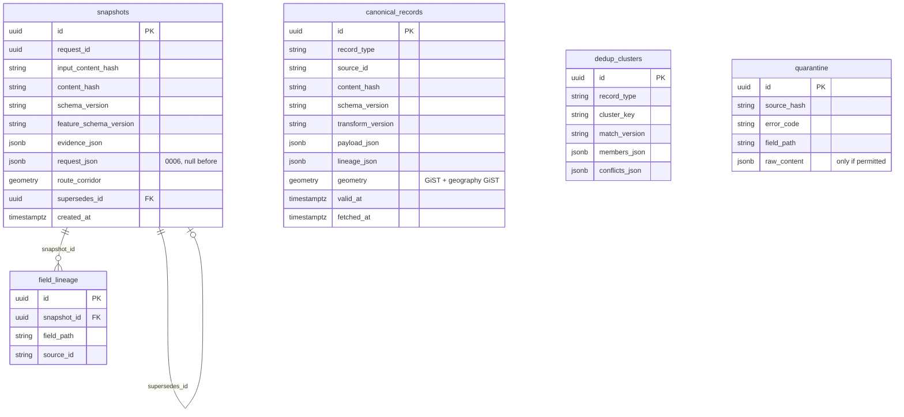

# [M05] Data Integration — module completion report

## 1. Metadata

| Field | Value |
| --- | --- |
| Module/owner | 05 Data Integration (`services/data-integration/`) |
| Issue/PR | Stack into `feat/05-data-integration`: #49, #37 → #38 → #39 → #50 (+#51) → #52 → #53 → #54 → #55 → #56 → #57 → #58 → #59 → #60 (+#61) → #41 → #62 → #65 → #66 → #67 → #68 → #71 → #72 → #73 → #74 → this PR |
| Branch | `test/05-live-e2e` |
| Base/final commit | Module branch base `d8a78c9` (`main`); module tip `74d9831` plus this report |
| Date/time | 2026-09-21 Asia/Bangkok |
| Reviewers | Team Lead, contract owner, modules 03, 04, 06, 07 |
| Contract versions | `IntegratedTravelContext` 1.0.0 · feature schema 1.0.0 (module 06, with the Lead decision on #43/#44) · `internal-data-integration.yaml` 1.0.0 |
| Docker image | `smart-travel-data-integration:runtime` (see §10 for the digest of each phase) |

## 2. Executive summary

Module 05 turns canonical module 04 records into an immutable, versioned, traceable `IntegratedTravelContext` for one route candidate. It validates every input against the generated contract models and quarantines what fails. It normalizes units and times, keeps field lineage, groups duplicates and keeps conflicts visible, samples the route with ETAs, and finds hazards in a PostGIS geography corridor. It then builds the module 06 features, scores and gates quality, and stores the snapshot once. A live end-to-end run over three time zones went from module 04 providers through the database to validated snapshots, and after a `pg_dump`/restore every snapshot rebuilt to the same content hash. A missing provider never becomes a safe-looking value: it stays `null` and pushes the gate to DEGRADED or BLOCK.

## 3. Acceptance checklist (plan §Acceptance)

| Item | Evidence |
| --- | --- |
| Validation and quarantine | Generated contract models at ingest (#55); quarantine once per source hash (#71); live run quarantined 5 real records (§8) |
| Unit/time normalization and lineage | `normalize.py`, field-level lineage with transform checksum (§7 example) |
| Dedup and conflicts | Versioned matching (`MATCH_VERSION` 1.0.0); official vs community conflict kept `UNRESOLVED` and flagged (#74) |
| Route corridor and ETA | Geodesic sampling, dateline split, geography corridor, per-part buffer (#59, #60, #65) |
| Features v1 with no leakage | Module 06 schema; cutoff on features and stored evidence (#41, #67); batch/online byte parity (#68) |
| Quality gate | Weighted score, PASS/DEGRADED/BLOCK, cross-source conflicts (#62, #74) |
| Immutable snapshot, hash, supersedes | Trigger from `0002`; hash without identity/time; supersedes checked (#65) |
| API and contract | Three §5.3 endpoints; OpenAPI lint; service-generated example validated by the shared suite (#66, #67) |
| Parity and operations | Feature CLI, backfill/purge/rebuild, metrics, load plus EXPLAIN (#68, #71, #72, #73) |
| Final integration | Scenarios (#74); live E2E, restore and rebuild (this PR) |

## 4. Architecture

```text
module 04 /context/query ──► CanonicalRepository.ingest ──► integration.canonical_records ──┐
   (live providers)          (generated models, quarantine)   (lineage_json, geometry)      │
                                                                                            ▼
POST /internal/v1/snapshots ─► compute_route_features ◄── hazard_ids_in_corridor (PostGIS, CTE)
   (one route, cutoff)          sample_route · align · build_features (module 06 v1)
                             ─► dedup conflicts ─► measure_dimensions ─► summarize_quality (gate)
                             ─► corridor_buffer_geojson ─► assemble_snapshot (content hash)
                             ─► SnapshotRepository.save (idempotent, supersedes, request_json)
                                     │
                     integration.snapshots (immutable) ──► GET / validate / rebuild CLI
```

## 5. ERD



Unique keys: `snapshots (request_id, input_content_hash, schema_version)`; `canonical_records (record_type, source_id, content_hash)`; `dedup_clusters (record_type, cluster_key, match_version)`. `canonical_records` and `dedup_clusters` are joined by `source_id` values held in JSON, not by foreign keys.

Migrations: `0001` schema, snapshots, quarantine, lineage · `0002` snapshot immutability trigger · `0003` canonical records · `0004` dedup clusters · `0005` geography GiST index · `0006` snapshot request. Each migration has a downgrade.

## 6. Versions and formulas

| Name | Version | Where |
| --- | --- | --- |
| Transform | `TRANSFORM_VERSION` 1.0.0 (+ checksum per field) | `pipeline/normalize.py` |
| Dedup match | `MATCH_VERSION` 1.0.0 | `pipeline/dedup.py` |
| Corridor | `CORRIDOR_VERSION` 1.0.0 | `pipeline/corridor.py` |
| Alignment | `ALIGNMENT_VERSION` 1.0.0 | `pipeline/alignment.py` |
| Feature schema | 1.0.0 (module 06) | `pipeline/feature_schema.yaml` |
| Quality score | `quality.integrated/0.1.0` | `pipeline/quality.py` |
| Authority scale | `authority.scale/0.1.0` | `pipeline/quality.py` |
| Gate policy | `quality.gate/0.1.0` | `pipeline/build.py` |
| Snapshot schema | 1.0.0 | `pipeline/snapshot.py` |

- **Route samples:** great-circle interpolation no more than `ROUTE_SAMPLE_SPACING_M` (1000 m) apart. Each ETA is `departure + duration × distance / total_distance`. The route is split at the 180° meridian.
- **Corridor:** `ST_DWithin(geometry::geography, corridor, CORRIDOR_RADIUS_M)` (5000 m) on geography, with the travel window `valid_at ≤ end` and `ends_at` null or `≥ start`. The stored corridor is a per-dateline-part `ST_Buffer(geography, radius)`.
- **Quality score:** `0.25·freshness + 0.20·completeness + 0.25·coverage + 0.15·agreement + 0.15·authority`, rounded half-even to 4 places. Any unmeasured dimension makes the score null, and the other weights are never renormalized.
- **Gate:** BLOCK if identity or geometry is invalid or critical evidence is missing. DEGRADED if the score is null or below 0.85, coverage is below 0.8, any flag is set (including cross-source CONFLICTING), or any source is not FRESH. Otherwise PASS.

## 7. Lineage example (captured Open-Meteo Bangkok forecast)

```json
"location.coordinates.0": {
  "source_id": "open_meteo_forecast:13.743409,100.495865@2026-09-19T00:00:00+00:00",
  "source_ids": ["open_meteo_forecast:13.743409,100.495865@2026-09-19T00:00:00+00:00"],
  "source_path": "location.coordinates.0",
  "transform_version": "1.0.0",
  "transform_checksum": "sha256:31b6eec4e9f162095905dfba8eed8a6c529631ed39550636b36372939527e40f"
}
```

Every normalized field of a canonical record carries such an entry in `canonical_records.lineage_json`. A snapshot then lists every contributing `source_id`.

## 8. Real data and quarantine summary

- Tests use the module 04 captures (Open-Meteo, USGS, openrouteservice, MTA GTFS-RT; HTTP 200, licences in each fixture). The load volume copies the captured USGS payload onto a grid (test-only).
- **Live E2E (2026-09-21):** module 04 answered WEATHER and DISASTER for all three routes with no degraded services. It returned 465 disaster events for the Fiji query (no bbox, because the route crosses 180°) and 11 in the Los Angeles bbox. 5 were quarantined on `depth_km`: USGS publishes negative depths, which the shared contract forbids (#75).
- The route geometry was not live: there is no openrouteservice credential on this machine (P0-08). The Bangkok route is the captured openrouteservice record, and Fiji and Los Angeles are test-only lines.

## 9. Configuration and Docker

Optional variables (defaults in `app/settings.py`): `CORRIDOR_RADIUS_M`, `ROUTE_SAMPLE_SPACING_M`, `WEATHER_TIME_TOLERANCE_SECONDS`, `TRANSPORT_TIME_TOLERANCE_SECONDS`, `DUPLICATE_DISTANCE_M`, `DUPLICATE_TIME_SECONDS`, `QUALITY_MINIMUM_SCORE`, `QUALITY_MINIMUM_COVERAGE`, `QUARANTINE_RETENTION_DAYS`. Required: `INTERNAL_SERVICE_TOKEN`, `POSTGRES_*`.

```bash
docker compose -f compose.yaml -f compose.dev.yaml --profile app up -d --build --wait data-integration
docker compose -f compose.yaml -f compose.dev.yaml run --rm data-integration uv run pytest -q
docker compose -f compose.yaml -f compose.dev.yaml run --rm data-integration uv run python tests/e2e_live.py --database m05_e2e --keep
docker compose -f compose.yaml -f compose.dev.yaml exec postgres sh -c 'pg_dump -U "$POSTGRES_USER" -Fc -d m05_e2e -f /tmp/m05_e2e.dump && createdb -U "$POSTGRES_USER" m05_restore && pg_restore -U "$POSTGRES_USER" -d m05_restore /tmp/m05_e2e.dump'
docker compose -f compose.yaml -f compose.dev.yaml run --rm -e POSTGRES_DB=m05_restore data-integration uv run python -m app.cli.operations rebuild --snapshot-id <id>
```

## 10. Verification evidence

| Check | Result |
| --- | --- |
| Docker pytest (module tip) | `89 passed in 6.50s` (0 failed, 0 skipped) |
| Ruff lint / format | `All checks passed!` / `67 files already formatted` |
| mypy | `Found 23 errors in 4 files`: pre-existing in phases 2–4 (#48); none in phases 5–7 |
| Per-PR Docker tests | 6 → 13 → 15 → 19 → 22 → 28 → 29 → 34 → 39 → 54 → 60 → 68 → 73 → 77 → 80 → 83 → 84 → 89 passed, each branch tip run separately |
| Shared contract suite | `92 passed`; `npm run validate:examples` validates the service-generated snapshot |
| Service in Docker | `Up (healthy)`; `/health/ready` → `ready` |
| Corridor at 50k rows | Index Scan `ix_canonical_geography`, p50 49.9 ms / p95 51.9 ms (generic-plan defect fixed, #73) |
| Snapshot pipeline | p50 101.4 ms / p95 133.3 ms with 200 corridor events |

Live E2E (module 04 providers → canonical store → corridor → snapshot):

| Route | Time zone (local departure) | Weather | Disasters bbox → stored → corridor | HTTP | Gate | Valid | Hash |
| --- | --- | --- | --- | --- | --- | --- | --- |
| bangkok-captured-ors | Asia/Bangkok (14:00 +07:00) | 5 | 0 → 0 → 0 | 201 | DEGRADED | true | match |
| fiji-dateline-test-line | Pacific/Fiji (19:00 +12:00) | 10 | 465 → 461 → 0 | 201 | DEGRADED | true | match |
| los-angeles-test-line | America/Los_Angeles (00:00 −07:00) | 5 | 11 → 10 → 0 | 201 | DEGRADED | true | match |

DEGRADED is expected and truthful: module 04 leaves `completeness` null, so the score is null (#69).

Restore and rebuild: `pg_dump` 321,753 bytes → `pg_restore` exit 0 → restored DB has 3 snapshots, 471 canonical records, migration `0006`. `rebuild` gives `reproducible` for all three snapshot ids.

## 11. UI evidence

Not applicable: internal service.

## 12. Safety, security and privacy review

- [x] Official warnings are never weakened: official events are copied to `official_alerts`; an official EXTREME stays active against a community MINOR; unknown severity never becomes `false`.
- [x] Unavailable becomes null (never 0 or `false`) from the request to the stored feature, and the gate carries it.
- [x] No leakage: evidence learned after `recommendation_at` stays out of features and snapshots.
- [x] Immutable, idempotent snapshots; `rebuild` never writes.
- [x] No secret, PII or user location in code, logs, fixtures or metric labels; request errors never echo values.
- [x] Load data is test-only in throwaway databases.

## 13. Problems found and fixed during the module

| Problem | Fix | PR |
| --- | --- | --- |
| Road-graph age judged stale by a realtime threshold | Staleness from producer status | #62 (#46) |
| Replay would conflict (hash included id and time) | Hash without identity/time | #65 |
| Future evidence could enter a stored snapshot | Cutoff on stored lists | #67 |
| Quarantine counter never counted; duplicate quarantine rows | Repository path, once per hash | #71 |
| Corridor query 30× slower under a generic plan | Materialized CTE | #73 |
| Cross-source conflict not reaching the gate | `unresolved_conflicts` | #74 |
| Test assumed an empty shared database | Compare with the table count | #68 |

## 14. Performance and operations

Metrics are listed in `docs/handoffs/M05-parity-operations.md` §4. Maintenance commands: `backfill`, `purge-quarantine` (schedule it), `rebuild`. No SLO is set; the §10 figures are baselines from one local container.

## 15. Known limitations and coverage gaps

| Gap | Impact | Owner | Issue |
| --- | --- | --- | --- |
| `completeness` null from module 04 | Every snapshot DEGRADED | M04 | #69 |
| Negative USGS depth breaks the contract | Real events quarantined | Contract owner / M04 | #75 |
| No per-capability quality from module 04 | Callers must derive quality for empty answers | M04 / M03 | #76 |
| No evacuation data | Evacuation flag always null (non-critical per Lead) | M04 | #44 |
| Gate only in `quality_summary.notes` | Consumers parse text | Contract owner | #63 |
| Module 06 rejects `travel_window.timezone` | M06 cannot read our snapshots yet | M06 | #64 |
| Internal OpenAPI not linted in CI | Silent contract breakage possible | Contract owner | #70 |
| No openrouteservice credential | No live route geometry | M04 / credential owner | P0-08 |
| `field_lineage` table is never written | Lineage lives in `canonical_records.lineage_json` and snapshot `source_ids` instead | M05 | follow-up: drop or populate |
| `align_disaster` assumes Point | Area events must use the corridor query | M05 | #45 |
| 23 pre-existing mypy errors | Type bugs can slip | M05 | #48 |
| Old local databases can hold a pre-rebase `snapshots` shape | 503 on the old dev DB | each developer | see M05-snapshot-api §7 |
| `request_json` doubles snapshot rows | Storage growth | M05 / operations | retention policy |

## 16. Handoff

| Recipient | Ready | Must do |
| --- | --- | --- |
| M03 | `POST/GET/validate` snapshots, one route per call | Read `gate=` in notes until #63; pass module 04 quality per source (#76) |
| M04 | Consumer contract validation | #69, #75, #76, #44 |
| M06 | Snapshot with v1 features, batch CLI with online parity | #64; apply #43/#44 in PR #12 |
| M07 | Gate, flags, conflicts | Approve thresholds in `docs/quality-gate.md` |
| Contract owner | New internal OpenAPI and example | #63, #70, #75 |

## 17. Commit and PR inventory

All work is in PRs into the module branch `feat/05-data-integration` (none into `main`): #49, #37, #38, #39, #50, #51, #52, #53, #54, #55, #56, #57, #58, #59, #60, #61, #41, #62, #65, #66, #67, #68, #71, #72, #73, #74, and this PR. Phase reports: `M05-postgis-foundation`, `M05-normalization-lineage`, `M05-dedup-conflict`, `M05-route-corridor`, `M05-feature-quality`, `M05-snapshot-api`, `M05-parity-operations`, and this file.

## 18. Rollback and recovery

Each PR reverts independently from the top of the stack down. Migrations `0006` → `0001` have downgrades. Stored snapshots are self-contained JSON, and snapshots with `request_json` can be re-verified with `rebuild` after any restore.

## 19. Final declaration

- [x] Every phase in the plan (0–7) is implemented with evidence.
- [x] No required work is hidden; gaps are in §15 with owners and issues.
- [x] Contracts, migrations, configuration and reports are documented.
- [ ] Downstream owners have acted on the open issues.
- [ ] All PRs are reviewed and merged (team process).
