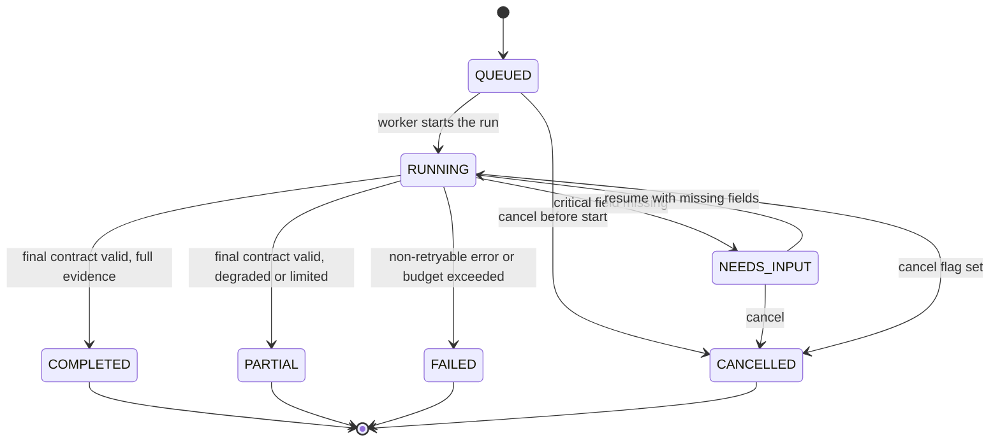
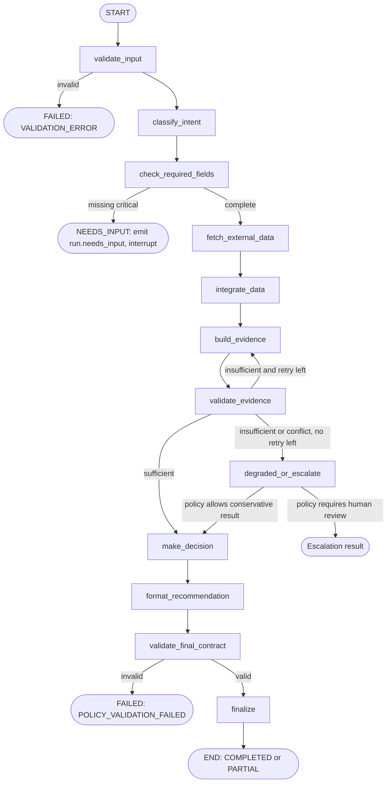

# Agent state machine — Module 03 (Travel AI Agent)

เอกสาร Phase 0 ของ `services/agent` อธิบาย state, edge, error, cancel และ resume ของ LangGraph

**แหล่งอ้างอิง**

- `IMPLEMENTATION_PLANS/03_TRAVEL_AI_AGENT_IMPLEMENTATION.md` (Graph design, Budgets and stop conditions, Follow-up)
- `IMPLEMENTATION_PLANS/00_API_AND_DATA_CONTRACTS.md` (ส่วน 2 enums, 5 internal APIs, 6 SSE)
- `IMPLEMENTATION_PLANS/00_SHARED_PROJECT_CONTEXT.md` (ส่วน 10 freshness)
- โค้ด: `services/agent/app/graph/state.py`, `services/agent/app/progress/events.py`

**สถานะเอกสาร:** ร่างเพื่อ review ข้อที่ไม่มีใน contract กลาง ทำเครื่องหมาย **[ข้อเสนอ]** ไว้ และรวบรวมไว้ในหัวข้อ "คำถามที่ต้องตกลง" ท้ายไฟล์

## 1. Run lifecycle (RunStatus)

ค่า status ตรงกับ `RunStatus` ใน contract ทุกตัว (QUEUED, RUNNING, NEEDS_INPUT, COMPLETED, PARTIAL, FAILED, CANCELLED)

Terminal status คือ COMPLETED, PARTIAL, FAILED, CANCELLED เมื่อถึงแล้วห้ามเปลี่ยนอีก NEEDS_INPUT ไม่ใช่ terminal (รอผู้ใช้ตอบ)

## 2. Graph flow

หลักการที่ทำให้ graph จบเสมอ (ไม่มี unlimited loop):

- มี **back-edge เดียว** คือ `validate_evidence -> build_evidence` และจำกัดจำนวนรอบด้วยค่า config **[ข้อเสนอ]** `EVIDENCE_RETRY_MAX=1`
- ทุกครั้งที่เปลี่ยน node ต้องเพิ่ม `control.step_count` แล้วเช็ก budget (หัวข้อ 5) ก่อนเข้า node ถัดไป
- retry ของ provider เกิดใน tool client เท่านั้น ไม่ย้อนกลับใน graph

## 3. Node table

| Node | GraphStage ที่ publish | Tool ที่เรียก | อ่านจาก state | เขียนลง state |
| --- | --- | --- | --- | --- |
| `validate_input` | `VALIDATING` | ไม่มี | `input.travel_request`, `control` | `control.errors` (ถ้าไม่ผ่าน) |
| `classify_intent` | `VALIDATING` | ไม่มี (deterministic ก่อน, LLM เฉพาะ ambiguous) | `input.travel_request.question` | `input.intent` |
| `check_required_fields` | `VALIDATING` | ไม่มี | `input.intent`, `input.travel_request` | `input.missing_fields` |
| `fetch_external_data` | `FETCHING_EXTERNAL_DATA` | `external_data.query_context@1` | `input.travel_request` | `observations.external_context_ref`, `quality.*` |
| `integrate_data` | `INTEGRATING_DATA` | `data_integration.create_snapshot@1` | `observations.external_context_ref` | `observations.snapshot_id`, `quality.*` |
| `build_evidence` | `ASSESSING_RISK`, `RETRIEVING_GUIDANCE`, `EVALUATING_ROUTES` | `risk_knowledge.build_evidence_package@1` | `observations.snapshot_id` | `observations.evidence_package_ref`, `result.risk_assessments`, `result.evidence_ids`, `result.route_ids` |
| `validate_evidence` | (ใช้ stage เดิม) | ไม่มี | `observations.*`, `result.*`, `quality.*` | `quality.conflicts`, `quality.freshness` |
| `degraded_or_escalate` | (ใช้ stage เดิม) | ไม่มี | `quality.*`, policy version | `quality.degraded_services`, `control.status` |
| `make_decision` | `MAKING_DECISION`, `EXPLAINING` | `decision_engine.create_decision@1` | `observations.evidence_package_ref` | `result.decision_id` |
| `format_recommendation` | `FORMATTING_RESPONSE` | `recommendation.create_recommendation@1` | `result.decision_id` | `result.recommendation_id` |
| `validate_final_contract` | (ใช้ stage เดิม) | ไม่มี | `result.*` | `control.errors` (ถ้าไม่ผ่าน) |
| `finalize` | (ใช้ stage เดิม) | ไม่มี | ทั้งหมด | `control.status` = COMPLETED หรือ PARTIAL |

หมายเหตุ

- ค่า `GraphStage` มี 9 ค่าตาม contract ไม่มี stage ของ node ที่ไม่เรียก tool ให้ใช้ stage ล่าสุดที่ publish ไว้ ห้ามเพิ่มค่าใหม่
- `build_evidence` เรียก tool เดียว (`evidence/package`) แต่ publish 3 stage ย่อยตามความคืบหน้าที่ Module 06 รายงาน **[ข้อเสนอ]** ถ้า Module 06 ไม่รายงานแยก ให้ publish เฉพาะ `ASSESSING_RISK`
- state เก็บเฉพาะ reference (id, ref) ห้ามเก็บ raw payload ของ provider
- agent **ห้ามตัดสิน risk หรือ action เอง** node `make_decision` ส่งต่อให้ Module 07 และห้ามแก้ผล

## 4. Error, degraded และ escalation

| สถานการณ์ | พฤติกรรม | Status สุดท้าย | Error code (contract) |
| --- | --- | --- | --- |
| input ไม่ผ่าน validation | หยุดทันที | `FAILED` | `VALIDATION_ERROR` |
| ขาดข้อมูลที่จำเป็น | emit `run.needs_input` แล้ว interrupt รอ resume | `NEEDS_INPUT` | ไม่มี (ไม่ใช่ error) |
| provider บางตัวล่ม แต่ policy อนุญาตให้ไปต่อ | ไปต่อ, ตั้ง `quality.degraded_services`, emit `run.degraded`, ลด confidence | `PARTIAL` | `DEPENDENCY_UNAVAILABLE` / `DEPENDENCY_TIMEOUT` (ใน event) |
| data integration, risk หรือ decision ล้ม | หยุด ไม่ bypass | `FAILED` | `DEPENDENCY_UNAVAILABLE`, `DEPENDENCY_TIMEOUT` หรือ `INTERNAL_ERROR` |
| หลักฐานไม่พอ | ไป `degraded_or_escalate` ให้ Module 07 ให้ผล conservative หรือ escalate ห้ามสรุปว่า safe | `PARTIAL` | `INSUFFICIENT_EVIDENCE` |
| นอกพื้นที่ที่รองรับ | ตั้ง flag `OUTSIDE_COVERAGE` แล้วแจ้งผู้ใช้ | `PARTIAL` หรือ `FAILED` **[ข้อเสนอ]** | `UNSUPPORTED_COVERAGE` |
| official warning ขัดกับข้อมูลอื่น | ไป `degraded_or_escalate` ตาม policy ห้ามลด warning ที่ active | escalation result | `POLICY_VALIDATION_FAILED` ถ้า validate ไม่ผ่าน |
| final contract ไม่ผ่าน | หยุด ไม่ส่งผลไม่ครบ | `FAILED` | `POLICY_VALIDATION_FAILED` |
| auth หรือ contract error แบบ non-retryable | หยุดทันที | `FAILED` | `AUTHENTICATION_REQUIRED` / `FORBIDDEN` / `INTERNAL_ERROR` |

- ทุก error ที่ส่งออกไปหา UI ต้องเป็น stable code + `message_key` เท่านั้น ห้ามมี stack trace, raw provider message หรือ secret
- `run.degraded` ต้อง publish ทันทีที่พบ ไม่รอจบ run

## 5. Budget และ stop conditions

ตรวจ **ก่อนเข้าทุก node** และ **ก่อนเรียกทุก tool** ตามลำดับความสำคัญ (บนสุดชนะ)

| ลำดับ | เงื่อนไข | Status | Error code |
| --- | --- | --- | --- |
| 1 | `control.cancelled` เป็น true | `CANCELLED` | ไม่มี |
| 2 | เกิน `AGENT_TOTAL_TIMEOUT_SECONDS` (deadline) | `FAILED` | `DEPENDENCY_TIMEOUT` |
| 3 | เกิน `MAX_AGENT_STEPS`, `MAX_TOOL_CALLS`, `MAX_LLM_CALLS`, token หรือ `MAX_ESTIMATED_COST_USD` | `FAILED` | **[ข้อเสนอ]** `AGENT_BUDGET_EXCEEDED` |
| 4 | ขาด critical field | `NEEDS_INPUT` | ไม่มี |
| 5 | final recommendation ผ่านการ validate | `COMPLETED` หรือ `PARTIAL` | ไม่มี |

ค่าเริ่มต้นจากแผน (ต้อง config ได้และบันทึก version ลง `versions`): `MAX_AGENT_STEPS=12`, `MAX_TOOL_CALLS=10`, `AGENT_TOTAL_TIMEOUT_SECONDS=45`, `AGENT_TOOL_TIMEOUT_SECONDS=12`, `MAX_LLM_CALLS=2` ส่วน token และ cost ในแผนยังเป็น `...` ต้องกำหนดค่า

## 6. Cancel

1. Module 02 เรียก `POST /internal/v1/runs/{id}/cancel`
2. agent ตั้ง `control.cancelled = true` และบันทึก checkpoint
3. tool client ที่กำลังทำงานอยู่ต้องรับสัญญาณยกเลิกและหยุดภายใน deadline ที่เหลือ
4. node ถัดไปเห็นเงื่อนไขลำดับ 1 แล้วจบเป็น `CANCELLED` และ publish event สุดท้าย
5. run ที่เป็น terminal อยู่แล้ว ตอบว่ายกเลิกไม่ได้ ห้ามเปลี่ยน status

## 7. Resume และ follow-up

- **thread ID = `conversation_id`** ส่วน run แต่ละครั้งแยกด้วย `request_id`
- resume ผ่าน `POST /internal/v1/runs/{id}/resume` ต้องตรวจว่า user/conversation ตรงกับเจ้าของ (ใช้ `user_scope_hash`) คนละ user ให้ปฏิเสธ (`FORBIDDEN`)

| กรณี | การทำงาน |
| --- | --- |
| `NEEDS_INPUT` แล้วผู้ใช้ตอบ | resume run เดิมจาก checkpoint เข้า `check_required_fields` ใหม่ |
| คำถามเชิงข้อมูล ใช้ evidence เดิมได้ และยัง fresh | resume จาก checkpoint แล้ว retrieve / decision / format ตามจำเป็น ไม่ fetch ใหม่ |
| ถามสถานการณ์ปัจจุบัน, route หรือเวลาเปลี่ยน, หรือเกิน TTL | fetch ใหม่ สร้าง snapshot ใหม่ ห้าม reuse score เก่า |
| แก้ trip (ต้นทาง ปลายทาง เวลา โหมด) | **ไม่แก้ state เดิม** สร้าง run ใหม่ ผูก `supersedes_request_id` |

TTL เริ่มต้น (จาก `00_SHARED_PROJECT_CONTEXT.md` ส่วน 10 ต้อง config ได้ ห้าม hard-code): severe alert 5 นาที, disaster event 10 นาที, current weather 15 นาที, hourly forecast 60 นาที, GTFS-RT 90 วินาที, route geometry 6 ชั่วโมงหรือเมื่อ route/เวลาเปลี่ยน

## 8. Intent

| Intent | ความหมาย | หมายเหตุ |
| --- | --- | --- |
| `PLAN_TRIP` | วางแผนเดินทางใหม่ | ต้องมีข้อมูลทริปครบ |
| `CHECK_SAFETY` | ตรวจความปลอดภัยของเส้นทางหรือเวลา | |
| `ASK_INFORMATION` | ถามข้อมูลทั่วไปที่เกี่ยวกับทริป | |
| `FOLLOW_UP` | ถามต่อจาก conversation เดิม | ตรวจ freshness ตามหัวข้อ 7 |
| `EMERGENCY` | เหตุฉุกเฉิน | ส่งทางลัดไปข้อมูลฉุกเฉิน **ห้ามติดต่อเจ้าหน้าที่เอง** |

รายการ critical missing fields ต่อ intent และกฎ classifier จะอยู่ในเอกสารแยก (Phase 0 ข้อ 4)

## 9. คำถามที่ต้องตกลง

1. **Error code สำหรับ budget เกิน** contract มี `DEPENDENCY_TIMEOUT` แต่ไม่มีโค้ดสำหรับ step/tool/cost เกิน ข้อเสนอ: เพิ่ม `AGENT_BUDGET_EXCEEDED` (ต้องให้คน 2 เพิ่มใน contract)
2. **Status ของกรณี escalation** ตอนนี้เสนอให้เป็น `PARTIAL` พร้อม flag ยังไม่มี status แยก ต้องตกลงกับคน 2 และคน 7
3. **Stage `EXPLAINING`** เสนอให้ publish ระหว่าง `make_decision` ต้องยืนยันกับคน 7 ว่าคำอธิบายถูกสร้างที่ Module 07
4. **Stage ย่อยของ `build_evidence`** ต้องยืนยันกับคน 6 ว่ารายงานความคืบหน้าแยกได้หรือไม่
5. **`EVIDENCE_RETRY_MAX`** เสนอ 1 รอบ ต้องตกลงค่าและว่านับรวมใน `MAX_TOOL_CALLS` หรือไม่
6. **ค่า token และ cost budget** (`MAX_INPUT_TOKENS`, `MAX_OUTPUT_TOKENS`, `MAX_ESTIMATED_COST_USD`) ในแผนยังไม่กำหนด
7. **`UNSUPPORTED_COVERAGE`** จบเป็น `PARTIAL` หรือ `FAILED`
